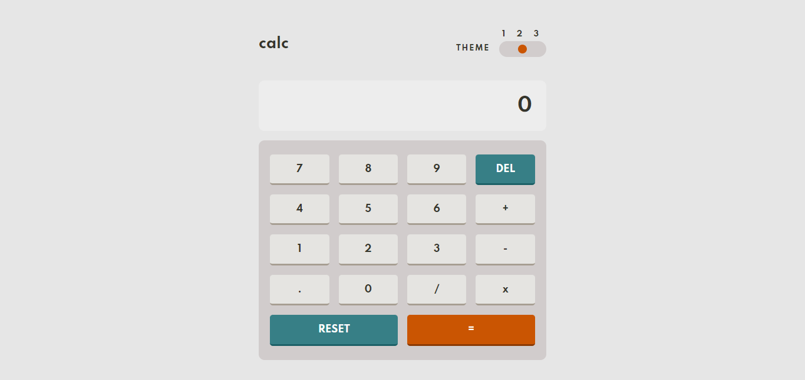

# Frontend Mentor - Calculator app solution

This is a solution to the [Calculator app challenge on Frontend Mentor](https://www.frontendmentor.io/challenges/calculator-app-9lteq5N29). Frontend Mentor challenges help you improve your coding skills by building realistic projects.

## The challenge

Users should be able to:

- See the size of the elements adjust based on their device's screen size
- Perform mathmatical operations like addition, subtraction, multiplication, and division
- Adjust the color theme based on their preference
- **Bonus**: Have their initial theme preference checked using `prefers-color-scheme` and have any additional changes saved in the browser

## Screenshot

## Links

- Solution URL: [GitHub repo](https://github.com/JustShuaib/calculator-app)
- Live Site URL: [Live site](https://calculator-app-shuaib.netlify.app/)

## Built with

- Semantic HTML5 markup
- CSS custom properties
- JavaScript

## Useful resources

- [Switching between different colour modes](https://webdesign.tutsplus.com/tutorials/color-schemes-with-css-variables-and-javascript--cms-36989)

## Author

- Github - [Adeoti Shuaib](https://www.github.com/JustShuaib)
- Frontend Mentor - [@justshuaib](https://www.frontendmentor.io/profile/justshuaib)
- Twitter - [@JustShuaib](https://www.twitter.com/JustShuaib)
